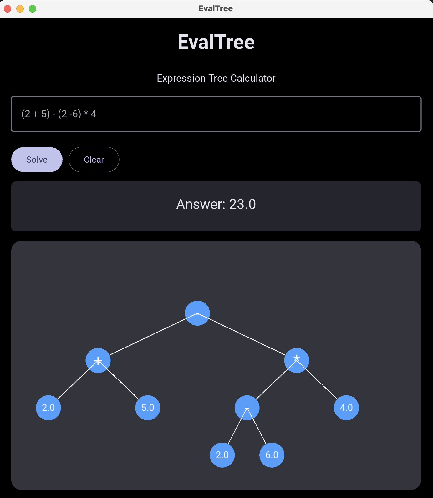

# 🎧 Eval Tree App — DSA in Real Life



This project demonstrates how data structures and algorithms can be applied in real life using an **Eval Tree App** as a case study.

We explore how different implementations impact performance and usability—starting from a simple approach and evolving into a more efficient design using a **Expression Tree**.

---

## 📁 Project Structure

This folder is organized into three main parts:

### 🧪 `starter/`
This is your playground.

- Contains the **starter code**
- Intended for you to **implement your own solution**
- Try solving the problem before looking at other implementations

👉 Think of this as your challenge zone.

---

### 🐢 `naive/`
This contains the **basic (naive) implementation**.

- Uses the Python built-in function `eval()`
- Easy to understand but comes with limitations:
    - `eval()` executes any Python code, not just arithmetic. This means user input can run malicious code. It’s unsafe for anything exposed to users.
        - No control over parsing logic.
        - You don’t control operator precedence
        - You can’t customize behavior
        - You can’t easily extend it (e.g., add your own operators)
    - Poor error handling control. Errors from `eval()` can be vague, inconsistent and hard to customize for users.
    - Less flexible for real-world scenarios

👉 This helps you understand *why* we need better data structures.

---

### ⚡ `dsa/`
This is the **optimized implementation using DSA**.

- Uses an **Expression Tree**
- Efficiently supports:
    - Basic arithmetic operators: `+`, `-`, `*`, `/`
    - Handle operator precedence correctly
    - Handle parentheses (e.g., `"(2 + 3) * 4"`)

👉 This is how a real-world calculator would internally process and evaluate expressions using a structured approach like an expression tree.

---

## 🚀 Getting Started

This project uses [`uv`](https://github.com/astral-sh/uv) for package management.

### 1. Install dependencies

Navigate into any folder (`starter`, `naive`, or `dsa`) and run:

```bash
uv sync
```
### 2. Run the app
```bash
uv run python main.py

# or using make
make
```