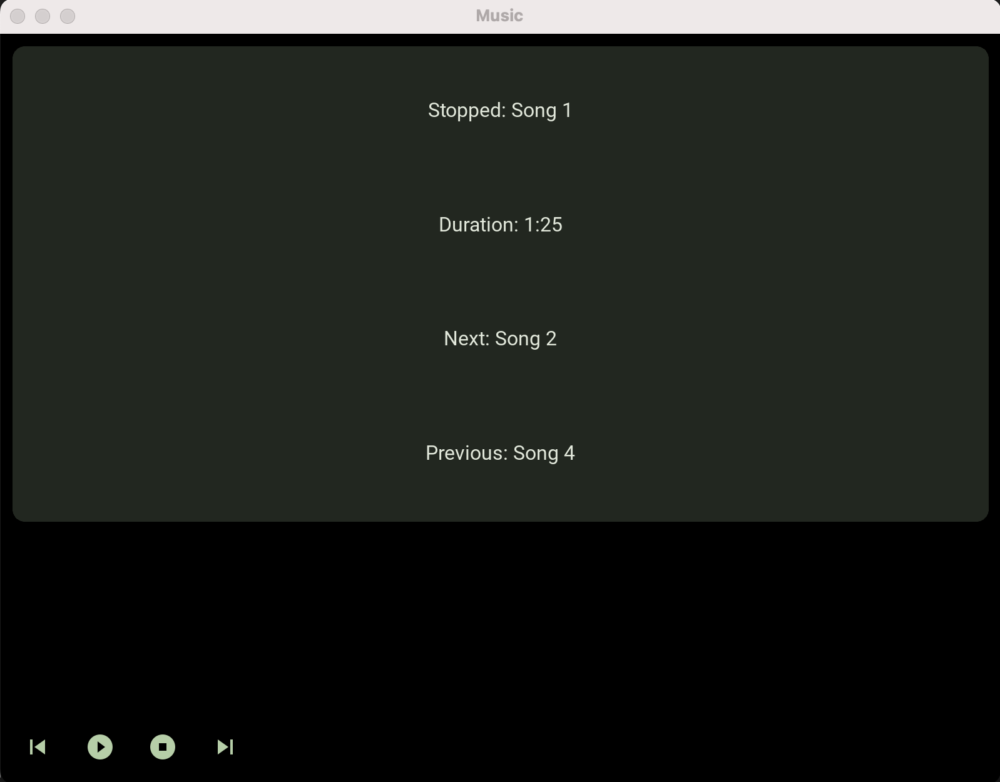

# 🎧 Music Player App — DSA in Real Life



This project demonstrates how data structures and algorithms can be applied in real life using a **Music Player App** as a case study.

We explore how different implementations impact performance and usability—starting from a simple approach and evolving into a more efficient design using a **Doubly Circular Linked List**.

---

## 📁 Project Structure

This folder is organized into three main parts:

### 🧪 `starter/`
This is your playground.

- Contains the **starter code**
- Intended for you to **implement your own solution**
- Try solving the problem before looking at other implementations

👉 Think of this as your challenge zone.

---

### 🐢 `naive/`
This contains the **basic (naive) implementation**.

- Uses a simple list to manage the playlist
- Easy to understand but comes with limitations:
  - Inefficient navigation (next/previous)
  - Poor handling of looping
  - Less flexible for real-world scenarios

👉 This helps you understand *why* we need better data structures.

---

### ⚡ `dsa/`
This is the **optimized implementation using DSA**.

- Uses a **Doubly Circular Linked List**
- Efficiently supports:
  - Next and previous song navigation
  - Seamless looping
  - Dynamic updates to the playlist

👉 This is how a real-world music player would handle playlists internally.

---

## 🚀 Getting Started

This project uses [`uv`](https://github.com/astral-sh/uv) for package management.

### 1. Install dependencies

Navigate into any folder (`starter`, `naive`, or `dsa`) and run:

```bash
uv sync
```
### 2. Run the app
```bash
uv run python main.py
```